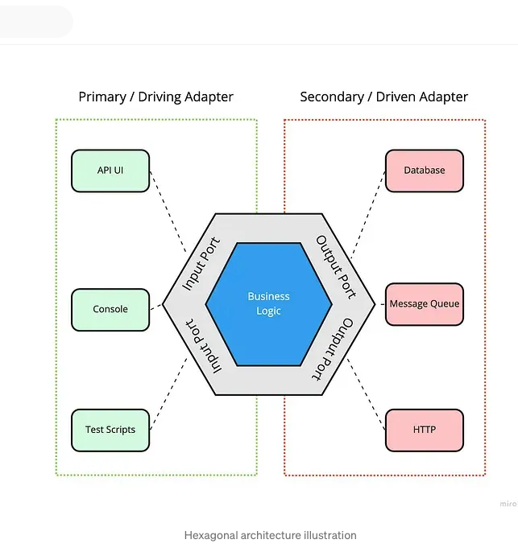

# Midas
Project repo for the JPMC Advanced Software Engineering Forage program

---

# Project notes
**Autumn Hicks | SWE, Java track @ WGU | Class of 2026**

*~ * purposely self-written and un-AI-generated to document my personal learning process * ~*


## Project Context
This project was created by JP Morgan to model implementing features in a real system with Spring Boot, Kafka, and a SQL database (H2).

From the project description:

>This repo focuses on Midas Core — the service responsible for receiving, validating, and recording financial transactions. Midas Core relies on several external systems:
>
>- Kafka to receive new transactions
>- A SQL database to validate and store data
>- A REST API to expose processed information


> The goal of this project is to implement a microservice that receives transactions from a bank and stores them in a database.

## Task 1: Clone Repo and Add Project Dependencies

- test 1 was failing because of the mis-configured application.yml originally.
- step 1: read the test and figure out what it's trying to test.

learning some tips:
- use documentation to verify project dependencies
  - Spring Initializr
  - Maven
- run one test at a time instead of all of them at once
  - at the start of a project when the tests are already written, we're working on getting one working at a time.
  - test-driven development: red, green, refactor.
- SDKMan with ZSH seems to work more smoothly with Java than Homebrew did with Fish (on Mac)

## Task 2: Integrate a Kafka Listener for `Transaction` Objects

This task is all about Kafka, so I'm starting by reading some of the documentation to get familiar with the context of the task.

### ( ** detour to go learn about Kafka so i know a little bit more about what i'm even trying to do for this task ** ...)

https://kafka.apache.org/42/getting-started/introduction/

key terms: 
- Kafka
- event streaming
  - publish/subscribe (pub/sub) design pattern
  - store streams of events
  - process streams of events

reading or writing data to kafka is called an event
- key, value, timestamp, and optional other information (metadata headers)
- (sounds like JSON over HTTP to me)

- producers write events to kafka
- consumers read and process the events

A key aspect of the pub/sub design is that the
producers and consumers are not tied to each other (decoupled).
they can function without depending on each other.

Events are organized into topics.
example: topics are like the folder and the files in the folder are the events.

for storage (?), topics are partitioned. for fault tolerance and high availibility, topics can be replicated (configuration options decide how replicated).

Kafka APIs:
- admin
- producer
- consumer
- Kafka Streams
- Kafka Connect

https://kafka.apache.org/quickstart/
https://www.youtube.com/watch?v=vHbvbwSEYGo&t=1s
(this video is priceless intro to Kafka wow.)

programs store information in databases.
databases encourage us to think in terms of things and state.
but instead of thinking of things first, what if we think of events first?
events have things included in them.

instead of storing events in databases,
we write them into logs.

Kafka manages those logs (topics).
topics are order collections of events.
each event represents a thing happening in the business.

when databases ruled the world,
large monoliths were the norm.

but thinking of events first and things second
leads to lots of smaller programs that can work independently
but that can also communicate through something like Kafka.

on top of those, 
we can build new services that provide real time analysis of that data
(just consuming messages from the topics in real time)
as opposed to running batch processes (over night etc.)

getting Kafka to talk with the databases can be done with Kafka Connect.


read (input)
process
write (output)

just a few general categories of what you like to do with those events: grouping, aggregating, enriching (joins).

Kafka Streams handles that kind of processing of the events.

### ( ** detour done, back to the task instructions** )

"your task is to integrate Kafka into Midas Core (this application)"

the application needs a way to receive all incoming transactions.
this will be the listener (consumer) for the Kafka topic.

the name of the topic has already been configured in the application.yml file.


configuring a Kafka listener
- deserialize the incoming message into the Transaction class (what does deserialize mean)
  - one type of deserialization: JSON to Java object (referencing the JSON Serializer and Deserializer)
  - https://medium.com/simform-engineering/kafka-integration-made-easy-with-spring-boot-b7aaf44d8889
- this task focuses *only* on integrating Kafka into Midas Core
- the test basically evaluates whether we're successfully receiving transactions (messages from Kafka)

### (** detour to go learn about Spring for Apache Kafka and Kafka Streams ** ...)


https://spring.io/projects/spring-kafka

https://docs.spring.io/spring-kafka/reference/quick-tour.html

we'll be using the `@KafkaListener` annotation to configure the listener.
````
    @KafkaListener(id = "myId", topics = "topic1")
    public void listen(String in) {
        System.out.println(in);
    }
````

https://docs.spring.io/spring-kafka/reference/kafka/receiving-messages.html


https://docs.spring.io/spring-kafka/docs/3.1.4/api/

https://www.confluent.io/learn/spring-boot-kafka

"Spring Boot streamlines Kafka integration 
by leveraging the Spring Kafka library, 
which offers annotations and configurations for 
Kafka producers, consumers, and listeners.
It automates much of the boilerplate setup, 
such as connector management and serialization, 
allowing developers to focus on business logic."


* check the pom.xml for the correct dependencies *

- it looks like this task is not asking me to create a producer at all.
- the test actually spins up a producer and gives something to "listen to" (other parts developed later)

**another detour: what architecture is this project using? Not MVC**


https://medium.com/@cedric-lekene/breaking-the-mvc-mold-clean-hexagonal-architecture-ea7b5a30e32a

https://kitemetric.com/blogs/hexagonal-vs-mvc-java-spring-boot-guide
```
hexagonal-architecture-example/
├── src/
│   ├── main/
│   │   ├── java/com/exemplo/
│   │   │   ├── domain/           // Core business logic
│   │   │   ├── application/      // Use cases
│   │   │   ├── infrastructure/   // Infrastructure components
│   │   │   │   ├── repository/  // Data persistence
│   │   │   │   ├── controller/  // REST API
│   │   │   ├── HexagonalApplication.java
│   ├── test/
```

it doesn't quite follow this one either though.

### ** A core question: where to integrate Kafka? **

putting the Kafka listener directly into `Transaction` would violate the design principle 
that each class should have a single responsibility.

the Kafka listener doesn't live in the Transaction object.
It **produces** a Transaction object ...
through deserialization!!

whatever the producer is sending, we're taking that form and turning it into a Transaction object.

since this is a service-type component, 
i can put the Kafka listener in the component package.


## Getting the integration to * actually * work:

---
### ** the big picture explanation (in hindsight, after implementation): **
#### ( i.e., high level overview of implementation)

- `TransactionKafkaListener.java`
  - @KafkaListener annotation
  - finding the example code for the listener in the Spring Kafka docs
  - https://docs.spring.io/spring-kafka/reference/quick-tour.html
- `application.yml`
  - configuring the Kafka listener
  - make sure the topic name is correct
  - JSON deserializer vs string deserializer
  - auto-offset-reset
    - `auto-offset-reset: earliest` tells Kafka to start reading from the beginning of the topic, ensuring that all messages are read.
    - without setting to `earliest,` the messages do not show up
  - targeting the correct class to deserialize into
- `TaskTwoTests.java`
  - examine the test to understand inputs and intended outputs
    - example: the test was sending a string and the Kafka producer was converting it into a `Transaction` object in `KafkaProducer.java`
    - understanding the inputs helps you understand which configuration to use (string vs JSON deserializer)
---

### Rough project notes (during implementation):

okay. now we have a basic Kafka listener implemented in the  `component` package.

next we need to learn what this even means: "deserialize kafka message to java object"


- https://docs.spring.io/spring-kafka/reference/kafka/serdes.html
  - "JSON deserialization with Jackson?"


but wait. what does the test send? are we deserializing from a string format?  

the tests for task2 ask for:

```
String[] transactionLines = fileLoader.loadStrings("/test_data/poiuytrewq.uiop");
```


Key realization: `application.yml` handles the configuration for deserialization.
- it looks like it *was* supposed to be the application.yml that should have been modified next
to handle the deserialization (had been wondering that)
  - https://www.youtube.com/watch?v=JGEo6mHu-2c


- helpful example application.yml file from the confluent tutorial:
  - https://www.confluent.io/learn/spring-boot-kafka/
  ```aiignore
  spring:
    kafka:
      bootstrap-servers: < BOOTSTRAP SERVERS >
      producer:
        key-serializer: org.apache.kafka.common.serialization.StringSerializer
        value-serializer: org.apache.kafka.common.serialization.StringSerializer
      consumer:
        group-id: my-group
        key-deserializer: org.apache.kafka.common.serialization.StringDeserializer
        value-deserializer: org.apache.kafka.common.serialization.StringDeserializer
  ```


- another question:
  - does this section of the application.yml file replace a full configuration file (for simple versions)?
  - it looks like full configuration files are for more complex versions.


- we probably don't need the producer section for this part, since it's only focused on 
the consumer aspect?

Notes: 
- a listener is a high-level type of consumer.
- we're not configuring an entire consumer here, we're using @KafkaListener to configure a listener.
- that difference is why we don't need a full configuration file.
- understanding what Spring is doing in the background helps with these kinds of questions

Questions I'm asking:
- according to the test, what bootstrap server should be configured? (error i'm getting as i run the tests)
- originally, the application.yml file only had StringSerializer and StringDeserializer.
- but the test is actually requiring JSON serialization and deserialization in order to deserialize to `Transaction` objects.


updated version of the `application.yml` file:
```
    producer:
      key-serializer: org.apache.kafka.common.serialization.StringSerializer
      value-serializer: org.springframework.kafka.support.serializer.JsonSerializer
    consumer:
      group-id: my-group
      key-deserializer: org.apache.kafka.common.serialization.StringDeserializer
      value-deserializer: org.apache.kafka.common.serialization.JsonDeserializer
```

- this still doesn't work because I'm getting an error about the types not being converted correctly.
- this is a deserialization problem. 
- still working on deserializing the messages into `Transaction` objects.


- https://docs.spring.io/spring-kafka/docs/3.1.4/reference/kafka/serdes.html
- https://developer.confluent.io/courses/spring/hands-on-consume-messages/#%20Receiving%20Messages%20with%20KafkaLn
- https://stackoverflow.com/questions/78196711/spring-boot-kafka-json-object-deserializtion

```aiignore

    # Set the value deserializer to Spring's JsonDeserializer
    spring.kafka.consumer.value-deserializer=org.springframework.kafka.support.serializer.JsonDeserializer

    # Specify the fully qualified name of the class you want to deserialize into
    spring.kafka.consumer.properties.spring.json.value.default.type=com.example.MyObject

    # (Optional) Allow specific packages for type safety
    spring.kafka.consumer.properties.spring.json.trusted.packages=com.example,org.acme.*
```


on the other hand, a quick system.out.println() in Test2 seems to show that the producer is sending strings, not JSON.
```aiignore
        String[] transactionLines = fileLoader.loadStrings("/test_data/poiuytrewq.uiop");
        for (String transactionLine : transactionLines) {
            System.out.println("Sending message: " + transactionLine);
            kafkaProducer.send(transactionLine);
        }
```

and yet when i run with

```aiignore
    producer:
      key-serializer: org.apache.kafka.common.serialization.StringSerializer
      value-serializer: org.apache.kafka.common.serialization.StringSerializer
    consumer:
      group-id: my-group
      key-deserializer: org.apache.kafka.common.serialization.StringDeserializer
      value-deserializer: org.apache.kafka.common.serialization.StringDeserializer
```

i get this error:
```aiignore
Can't convert value of class com.jpmc.midascore.foundation.Transaction to class org.apache.kafka.common.serialization.StringSerializer specified in value.serializer
```

how is it getting transaction objects if the test only ever sends strings?

```aiignore
throw new SerializationException("Can't convert value of class " + record.value().getClass().getName() + " to class " + this.producerConfig.getClass("value.serializer").getName() + " specified in value.serializer", cce);
```

the producer is being sent a `Transaction` object?
```

// this is a parsing solution, AI-recommended code, off discussion surrounding deserialization:)
// parses string into transaction type as a workaround to deserialize)

  private Transaction parseTransaction(String raw) {
       String[] parts = raw.split(",\\s*"); // comma + optional space
      long id = Integer.parseInt(parts[0]);
       long type = Integer.parseInt(parts[1]);
       float amount = Float.parseFloat(parts[2]);
       return new Transaction(id, type, amount);
   }

```

- since it's being sent an object, i should use json deserialization
- -- even though a string is being sent by the test??


**KEY STEP:** 
- added a breakpoint in the test itself to step through each part of the message-sending process before the listener even gets called 
- evaluating the message and what type it is at each point exposed something very helpful:
- *`KafkaProducer.java` actually has a converter that takes the string the test sends and creates a new transaction object with the string values.*

  ```aiignore
    public void send(String transactionLine) {
          String[] transactionData = transactionLine.split(", ");
          kafkaTemplate.send(topic, new Transaction(Long.parseLong(transactionData[0]), Long.parseLong(transactionData[1]), Float.parseFloat(transactionData[2])));
      }
  ```


- SOLUTION:
it looks like the test sends a string and then the Kafka producer class converts it into a `Transaction` object.


notes on debugging:
- using the debugger to step through the code is a super helpful way to learn what's going on.
- taking it one step at a time with the debugger helps you actually slow down and read the code
- for tracking values (such as the `transactionLine` variable), add breakpoints and use the "Threads & Variables" tab in the Debug window.

- https://stackoverflow.com/questions/32390265/what-determines-kafka-consumer-offset
- https://medium.com/lydtech-consulting/kafka-consumer-auto-offset-reset-d3962bad2665

**KEY STEP:**
- add the following to the application.yml file:
  - `auto-offset-reset: earliest`
  - this tells Kafka to start reading from the beginning of the topic, ensuring that all messages are read

## Task 3: Add a database (H2) and data ingestion (Kafka)

### Examining the task instructions:
>**Task instructions:**
> 
> - Configure Midas Core to use an H2 in-memory database through Spring Boot and JPA.
>
> - Implement validation logic to determine whether a transaction is valid based on user IDs and account balances.
>
> - Create a TransactionRecord JPA entity and persist valid transactions while discarding invalid ones.
>
> - Update the sender and recipient balances when transactions are successfully processed.
>
> - Run TaskThreeTests, inspect the final balance of the waldorf user in your debugger, and submit the rounded-down value.


**validation logic:**
>A transaction is considered valid if the following are true:
>
> - The senderId is valid
> - The recipientId is valid
> - The sender has a balance greater than or equal to the transaction amount

### Quick brainstorm before hitting the docs:

- last project where I added a database was a MVC Spring project.
  - model, view, controller
  - do we write controllers here?
  - maybe we don't even deal with controllers because it's completely backend and there currently is no frontend
  - do controllers only exist to handle interaction between the frontend and backend?


- @Valid will likely come into play here
  - sender balance > = transaction.amount
  - how to access the sender balance? (repository action?)

- steps to take (possibly):
  - link H2 database to Midas Core
  - validate transaction (entity @valid)
  - record to database (repository action)
  - update sender and recipient balances (repository action too?)
  - how do you delete a transaction before it's added to the database (case of invalid transaction)?

> Transaction entities should maintain a many-to-one relationship 
> with their respective sender and recipient User entities 
> 
> (hint: this will necessitate creating a new TransactionRecord class 
> with an @entity annotation rather than modifying the existing Transaction class).

> Integrate with the database using Spring Data JPA.


- `UserRepository.java` (already written) answers "how will i access the sender balance?"
  ```aiignore
  public interface UserRepository extends CrudRepository<UserRecord, Long> {
  UserRecord findById(long id);
  }
  ```
- `DatabaseConduit.java` has a helpful `save()` method for saving user records to the database.
  ```aiignore
  public class DatabaseConduit {
  private final UserRepository userRepository;
  
      public DatabaseConduit(UserRepository userRepository) {
          this.userRepository = userRepository;
      }
  
      public void save(UserRecord userRecord) {
          userRepository.save(userRecord);
      }

  }
  ```
  
- from reading test3, it looks like this test goes like this:
  - loads users and transactions
  - so going into the test, I'm starting with an empty database
  - I just need to tell the listener (already built) what to do with the messages
    - use Spring Data JPA and CRUD Repository (there's already an example written)
    - validate the transaction first
    - save the transaction if it's valid using JPA
    - update the sender and recipient balances  
    
  ```
    void task_three_verifier() throws InterruptedException {
        userPopulator.populate();
        String[] transactionLines = fileLoader.loadStrings("/test_data/mnbvcxz.vbnm");
        for (String transactionLine : transactionLines) {
            kafkaProducer.send(transactionLine);
        }
  ```
  
- ** thoughts and reflections: **
  - wow we use application.yml a lot more than i realized we would


- I think the most important thing to remember is that the Kafka listener is only responsible for receiving messages.
- the rest of the application is responsible for processing the messages and updating the database.

### Step 1: configure H2 database

- helpful tutorial
  - https://www.baeldung.com/spring-boot-h2-database
  - add dependencies (already added in step 1 actually)
  - Spring JPA and H2 are the main dependencies to add.
  - configure application.yml to for H2 console, JPA, and basic H2

### Step 2: 
- Spring JPA docs
  - https://docs.spring.io/spring-data/jpa/reference/repositories/core-concepts.html