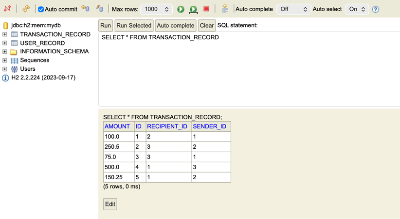
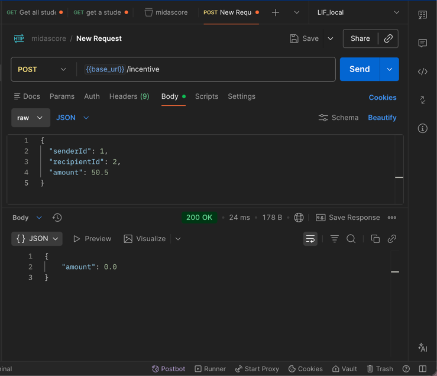

# Midas
Project repo for the JPMC Advanced Software Engineering Forage program

---

# Project notes
### Autumn Hicks | SWE, Java track @ WGU | Class of 2026
*~ * purposely self-written and un-AI-generated to document my personal learning process * ~*
*~ * February 2 * ~*


## Project Context
The scaffold for this project was created by JP Morgan to model implementing features in a real system with Spring Boot, Kafka, and a SQL database (H2).

From the project description:

>This repo focuses on Midas Core — the service responsible for receiving, validating, and recording financial transactions. Midas Core relies on several external systems:
>
>- Kafka to receive new transactions
>- A SQL database to validate and store data
>- A REST API to expose processed information


> The goal of this project is to implement a microservice that receives transactions from a bank and stores them in a database.

## Task 1: Clone Repo and Add Project Dependencies

- test 1 was failing because of the mis-configured application.yml originally.
- step 1: read the test and figure out what it's trying to test.

learning some tips:
- use documentation to verify project dependencies
  - Spring Initializr
  - Maven
- run one test at a time instead of all of them at once
  - at the start of a project when the tests are already written, we're working on getting one working at a time.
  - test-driven development: red, green, refactor.
- SDKMan with ZSH seems to work more smoothly with Java than Homebrew did with Fish (on Mac)

## Task 2: Integrate a Kafka Listener for `Transaction` Objects

This task is all about Kafka, so I'm starting by reading some of the documentation to get familiar with the context of the task.

### ( ** detour to go learn about Kafka so i know a little bit more about what i'm even trying to do for this task ** ...)

https://kafka.apache.org/42/getting-started/introduction/

key terms: 
- Kafka
- event streaming
  - publish/subscribe (pub/sub) design pattern
  - store streams of events
  - process streams of events

reading or writing data to kafka is called an event
- key, value, timestamp, and optional other information (metadata headers)
- (sounds like JSON over HTTP to me)

- producers write events to kafka
- consumers read and process the events

A key aspect of the pub/sub design is that the
producers and consumers are not tied to each other (decoupled).
they can function without depending on each other.

Events are organized into topics.
example: topics are like the folder and the files in the folder are the events.

for storage (?), topics are partitioned. for fault tolerance and high availibility, topics can be replicated (configuration options decide how replicated).

Kafka APIs:
- admin
- producer
- consumer
- Kafka Streams
- Kafka Connect

https://kafka.apache.org/quickstart/
https://www.youtube.com/watch?v=vHbvbwSEYGo&t=1s
(this video is priceless intro to Kafka wow.)

programs store information in databases.
databases encourage us to think in terms of things and state.
but instead of thinking of things first, what if we think of events first?
events have things included in them.

instead of storing events in databases,
we write them into logs.

Kafka manages those logs (topics).
topics are order collections of events.
each event represents a thing happening in the business.

when databases ruled the world,
large monoliths were the norm.

but thinking of events first and things second
leads to lots of smaller programs that can work independently
but that can also communicate through something like Kafka.

on top of those, 
we can build new services that provide real time analysis of that data
(just consuming messages from the topics in real time)
as opposed to running batch processes (over night etc.)

getting Kafka to talk with the databases can be done with Kafka Connect.


read (input)
process
write (output)

just a few general categories of what you like to do with those events: grouping, aggregating, enriching (joins).

Kafka Streams handles that kind of processing of the events.

### ( ** detour done, back to the task instructions** )

"your task is to integrate Kafka into Midas Core (this application)"

the application needs a way to receive all incoming transactions.
this will be the listener (consumer) for the Kafka topic.

the name of the topic has already been configured in the application.yml file.


configuring a Kafka listener
- deserialize the incoming message into the Transaction class (what does deserialize mean)
  - one type of deserialization: JSON to Java object (referencing the JSON Serializer and Deserializer)
  - https://medium.com/simform-engineering/kafka-integration-made-easy-with-spring-boot-b7aaf44d8889
- this task focuses *only* on integrating Kafka into Midas Core
- the test basically evaluates whether we're successfully receiving transactions (messages from Kafka)

### (** detour to go learn about Spring for Apache Kafka and Kafka Streams ** ...)


https://spring.io/projects/spring-kafka

https://docs.spring.io/spring-kafka/reference/quick-tour.html

we'll be using the `@KafkaListener` annotation to configure the listener.
````
    @KafkaListener(id = "myId", topics = "topic1")
    public void listen(String in) {
        System.out.println(in);
    }
````

https://docs.spring.io/spring-kafka/reference/kafka/receiving-messages.html


https://docs.spring.io/spring-kafka/docs/3.1.4/api/

https://www.confluent.io/learn/spring-boot-kafka

"Spring Boot streamlines Kafka integration 
by leveraging the Spring Kafka library, 
which offers annotations and configurations for 
Kafka producers, consumers, and listeners.
It automates much of the boilerplate setup, 
such as connector management and serialization, 
allowing developers to focus on business logic."


* check the pom.xml for the correct dependencies *

- it looks like this task is not asking me to create a producer at all.
- the test actually spins up a producer and gives something to "listen to" (other parts developed later)

**another detour: what architecture is this project using? Not MVC**


https://medium.com/@cedric-lekene/breaking-the-mvc-mold-clean-hexagonal-architecture-ea7b5a30e32a

https://kitemetric.com/blogs/hexagonal-vs-mvc-java-spring-boot-guide
```
hexagonal-architecture-example/
├── src/
│   ├── main/
│   │   ├── java/com/exemplo/
│   │   │   ├── domain/           // Core business logic
│   │   │   ├── application/      // Use cases
│   │   │   ├── infrastructure/   // Infrastructure components
│   │   │   │   ├── repository/  // Data persistence
│   │   │   │   ├── controller/  // REST API
│   │   │   ├── HexagonalApplication.java
│   ├── test/
```

it doesn't quite follow this one either though.

### ** A core question: where to integrate Kafka? **

putting the Kafka listener directly into `Transaction` would violate the design principle 
that each class should have a single responsibility.

the Kafka listener doesn't live in the Transaction object.
It **produces** a Transaction object ...
through deserialization!!

whatever the producer is sending, we're taking that form and turning it into a Transaction object.

since this is a service-type component, 
i can put the Kafka listener in the component package.


## Getting the integration to * actually * work:

---
### ** the big picture explanation (in hindsight, after implementation): **
#### ( i.e., high level overview of implementation)

- `TransactionKafkaListener.java`
  - @KafkaListener annotation
  - finding the example code for the listener in the Spring Kafka docs
  - https://docs.spring.io/spring-kafka/reference/quick-tour.html
- `application.yml`
  - configuring the Kafka listener
  - make sure the topic name is correct
  - JSON deserializer vs string deserializer
  - auto-offset-reset
    - `auto-offset-reset: earliest` tells Kafka to start reading from the beginning of the topic, ensuring that all messages are read.
    - without setting to `earliest,` the messages do not show up
  - targeting the correct class to deserialize into
- `TaskTwoTests.java`
  - examine the test to understand inputs and intended outputs
    - example: the test was sending a string and the Kafka producer was converting it into a `Transaction` object in `KafkaProducer.java`
    - understanding the inputs helps you understand which configuration to use (string vs JSON deserializer)
---

### Rough project notes (during implementation):

okay. now we have a basic Kafka listener implemented in the  `component` package.

next we need to learn what this even means: "deserialize kafka message to java object"


- https://docs.spring.io/spring-kafka/reference/kafka/serdes.html
  - "JSON deserialization with Jackson?"


but wait. what does the test send? are we deserializing from a string format?  

the tests for task2 ask for:

```
String[] transactionLines = fileLoader.loadStrings("/test_data/poiuytrewq.uiop");
```


Key realization: `application.yml` handles the configuration for deserialization.
- it looks like it *was* supposed to be the application.yml that should have been modified next
to handle the deserialization (had been wondering that)
  - https://www.youtube.com/watch?v=JGEo6mHu-2c


- helpful example application.yml file from the confluent tutorial:
  - https://www.confluent.io/learn/spring-boot-kafka/
  ```aiignore
  spring:
    kafka:
      bootstrap-servers: < BOOTSTRAP SERVERS >
      producer:
        key-serializer: org.apache.kafka.common.serialization.StringSerializer
        value-serializer: org.apache.kafka.common.serialization.StringSerializer
      consumer:
        group-id: my-group
        key-deserializer: org.apache.kafka.common.serialization.StringDeserializer
        value-deserializer: org.apache.kafka.common.serialization.StringDeserializer
  ```


- another question:
  - does this section of the application.yml file replace a full configuration file (for simple versions)?
  - it looks like full configuration files are for more complex versions.


- we probably don't need the producer section for this part, since it's only focused on 
the consumer aspect?

Notes: 
- a listener is a high-level type of consumer.
- we're not configuring an entire consumer here, we're using @KafkaListener to configure a listener.
- that difference is why we don't need a full configuration file.
- understanding what Spring is doing in the background helps with these kinds of questions

Questions I'm asking:
- according to the test, what bootstrap server should be configured? (error i'm getting as i run the tests)
- originally, the application.yml file only had StringSerializer and StringDeserializer.
- but the test is actually requiring JSON serialization and deserialization in order to deserialize to `Transaction` objects.


updated version of the `application.yml` file:
```
    producer:
      key-serializer: org.apache.kafka.common.serialization.StringSerializer
      value-serializer: org.springframework.kafka.support.serializer.JsonSerializer
    consumer:
      group-id: my-group
      key-deserializer: org.apache.kafka.common.serialization.StringDeserializer
      value-deserializer: org.apache.kafka.common.serialization.JsonDeserializer
```

- this still doesn't work because I'm getting an error about the types not being converted correctly.
- this is a deserialization problem. 
- still working on deserializing the messages into `Transaction` objects.


- https://docs.spring.io/spring-kafka/docs/3.1.4/reference/kafka/serdes.html
- https://developer.confluent.io/courses/spring/hands-on-consume-messages/#%20Receiving%20Messages%20with%20KafkaLn
- https://stackoverflow.com/questions/78196711/spring-boot-kafka-json-object-deserializtion

```aiignore

    # Set the value deserializer to Spring's JsonDeserializer
    spring.kafka.consumer.value-deserializer=org.springframework.kafka.support.serializer.JsonDeserializer

    # Specify the fully qualified name of the class you want to deserialize into
    spring.kafka.consumer.properties.spring.json.value.default.type=com.example.MyObject

    # (Optional) Allow specific packages for type safety
    spring.kafka.consumer.properties.spring.json.trusted.packages=com.example,org.acme.*
```


on the other hand, a quick system.out.println() in Test2 seems to show that the producer is sending strings, not JSON.
```aiignore
        String[] transactionLines = fileLoader.loadStrings("/test_data/poiuytrewq.uiop");
        for (String transactionLine : transactionLines) {
            System.out.println("Sending message: " + transactionLine);
            kafkaProducer.send(transactionLine);
        }
```

and yet when i run with

```aiignore
    producer:
      key-serializer: org.apache.kafka.common.serialization.StringSerializer
      value-serializer: org.apache.kafka.common.serialization.StringSerializer
    consumer:
      group-id: my-group
      key-deserializer: org.apache.kafka.common.serialization.StringDeserializer
      value-deserializer: org.apache.kafka.common.serialization.StringDeserializer
```

i get this error:
```aiignore
Can't convert value of class com.jpmc.midascore.foundation.Transaction to class org.apache.kafka.common.serialization.StringSerializer specified in value.serializer
```

how is it getting transaction objects if the test only ever sends strings?

```aiignore
throw new SerializationException("Can't convert value of class " + record.value().getClass().getName() + " to class " + this.producerConfig.getClass("value.serializer").getName() + " specified in value.serializer", cce);
```

the producer is being sent a `Transaction` object?
```

// this is a parsing solution, AI-recommended code, off discussion surrounding deserialization:)
// parses string into transaction type as a workaround to deserialize)

  private Transaction parseTransaction(String raw) {
       String[] parts = raw.split(",\\s*"); // comma + optional space
      long id = Integer.parseInt(parts[0]);
       long type = Integer.parseInt(parts[1]);
       float amount = Float.parseFloat(parts[2]);
       return new Transaction(id, type, amount);
   }

```

- since it's being sent an object, i should use json deserialization
- -- even though a string is being sent by the test??


**KEY STEP:** 
- added a breakpoint in the test itself to step through each part of the message-sending process before the listener even gets called 
- evaluating the message and what type it is at each point exposed something very helpful:
- *`KafkaProducer.java` actually has a converter that takes the string the test sends and creates a new transaction object with the string values.*

  ```aiignore
    public void send(String transactionLine) {
          String[] transactionData = transactionLine.split(", ");
          kafkaTemplate.send(topic, new Transaction(Long.parseLong(transactionData[0]), Long.parseLong(transactionData[1]), Float.parseFloat(transactionData[2])));
      }
  ```


- SOLUTION:
it looks like the test sends a string and then the Kafka producer class converts it into a `Transaction` object.


notes on debugging:
- using the debugger to step through the code is a super helpful way to learn what's going on.
- taking it one step at a time with the debugger helps you actually slow down and read the code
- for tracking values (such as the `transactionLine` variable), add breakpoints and use the "Threads & Variables" tab in the Debug window.

- https://stackoverflow.com/questions/32390265/what-determines-kafka-consumer-offset
- https://medium.com/lydtech-consulting/kafka-consumer-auto-offset-reset-d3962bad2665

**KEY STEP:**
- add the following to the application.yml file:
  - `auto-offset-reset: earliest`
  - this tells Kafka to start reading from the beginning of the topic, ensuring that all messages are read

## Task 3: Add a database (H2) and data ingestion (Kafka)

### Examining the task instructions:
>**Task instructions:**
> 
> - Configure Midas Core to use an H2 in-memory database through Spring Boot and JPA.
>
> - Implement validation logic to determine whether a transaction is valid based on user IDs and account balances.
>
> - Create a TransactionRecord JPA entity and persist valid transactions while discarding invalid ones.
>
> - Update the sender and recipient balances when transactions are successfully processed.
>
> - Run TaskThreeTests, inspect the final balance of the waldorf user in your debugger, and submit the rounded-down value.


**validation logic:**
>A transaction is considered valid if the following are true:
>
> - The senderId is valid
> - The recipientId is valid
> - The sender has a balance greater than or equal to the transaction amount

### Quick brainstorm before hitting the docs:

- last project where I added a database was a MVC Spring project.
  - model, view, controller
  - do we write controllers here?
  - maybe we don't even deal with controllers because it's completely backend and there currently is no frontend
  - do controllers only exist to handle interaction between the frontend and backend?


- @Valid will likely come into play here
  - sender balance > = transaction.amount
  - how to access the sender balance? (repository action?)

- steps to take (possibly):
  - link H2 database to Midas Core
  - validate transaction (entity @valid)
  - record to database (repository action)
  - update sender and recipient balances (repository action too?)
  - how do you delete a transaction before it's added to the database (case of invalid transaction)?

> Transaction entities should maintain a many-to-one relationship 
> with their respective sender and recipient User entities 
> 
> (hint: this will necessitate creating a new TransactionRecord class 
> with an @entity annotation rather than modifying the existing Transaction class).

> Integrate with the database using Spring Data JPA.


- `UserRepository.java` (already written) answers "how will i access the sender balance?"
  ```aiignore
  public interface UserRepository extends CrudRepository<UserRecord, Long> {
  UserRecord findById(long id);
  }
  ```
- `DatabaseConduit.java` has a helpful `save()` method for saving user records to the database.
  ```aiignore
  public class DatabaseConduit {
  private final UserRepository userRepository;
  
      public DatabaseConduit(UserRepository userRepository) {
          this.userRepository = userRepository;
      }
  
      public void save(UserRecord userRecord) {
          userRepository.save(userRecord);
      }

  }
  ```
  
- from reading test3, it looks like this test goes like this:
  - loads users and transactions
  - so going into the test, I'm starting with an empty database
  - I just need to tell the listener (already built) what to do with the messages
    - use Spring Data JPA and CRUD Repository (there's already an example written)
    - validate the transaction first
    - save the transaction if it's valid using JPA
    - update the sender and recipient balances  
    
  ```
    void task_three_verifier() throws InterruptedException {
        userPopulator.populate();
        String[] transactionLines = fileLoader.loadStrings("/test_data/mnbvcxz.vbnm");
        for (String transactionLine : transactionLines) {
            kafkaProducer.send(transactionLine);
        }
  ```
  
- ** thoughts and reflections: **
  - wow we use application.yml a lot more than i realized we would


- I think the most important thing to remember is that the Kafka listener is only responsible for receiving messages.
- the rest of the application is responsible for processing the messages and updating the database.

### Step 1: configure H2 database

- helpful tutorial
  - https://www.baeldung.com/spring-boot-h2-database
  - add dependencies (already added in step 1 actually)
  - Spring JPA and H2 are the main dependencies to add.
  - configure application.yml to for H2 console, JPA, and basic H2

### Step 2: add the TransactionRecord entity & repository
- Spring JPA docs
  - https://docs.spring.io/spring-data/jpa/reference/repositories/core-concepts.html


- the tasks list went like this:
  - implement H2
  - implmenet validation logic
    - where does the validation logic go?
    - what type calls JPA, is it entities? transactionRecord calls JPA?
    - where would @Valid be used, if at all?
  
- **key question:** what fields does transactionRecord need to have?
  - it should match `Transaction.java`:
  ```
    private long senderId;
    private long recipientId;
    private float amount;
    ```
  - since it has those same fields, should I extend the class?
    - no, because it's an entity, not a [?] (whatever `Transaction` actually is)
    - because it's an entity, it maps to DB columns and needs explicit fields in order to do that.
  - for getters and setters, should you really be able to set the recipientId and senderId etc?

  
- **I really need a refresher on Spring Data JPA and entities**.
  - ** Entities ARE the models. ** (MVC)
  - ** Repositories handle the model-database interactions. **


- Very helpful definition of Spring Data JPA:
  > JPA repositories are interfaces in Spring Data 
  > that allow you to perform basic CRUD (Create, Read, Update, Delete) operations 
  > without writing complex SQL queries. 
  > Instead of writing SQL, you work with Java objects, 
  > and Spring Data JPA takes care of translating these operations into database commands.
  
  - Source: https://medium.com/@aissatoub4228/a-beginners-guide-to-spring-boot-jpa-repositories-simplifying-database-access-151a74a772db

- okay, so going off that definition...
- transactionRecord entity means a table in the db represented by a Java object
  - fields are columns in the table
  - the way we will interact with this transactionRecord entity (table) is not through raw SQL in a db tool
  - we will interact with the transactionRecord entity (table) through the Spring Data JPA repository
    - since we're using Spring Data JPA, we will need a repository interface for transactionRecord that extends CrudRepository
    - updating the sender and recipient balances will be done through the repository interface

- reading more...
  - https://spring.io/guides/gs/accessing-data-jpa
  - https://docs.spring.io/spring-data/jpa/reference/repositories/core-concepts.html

- add `TransactionRecordRepository.java` to extend `CRUDRepository`:

  ```aiignore
  public interface TransactionRecordRepository extends CrudRepository<TransactionRecord, Long> {
  
  }
  ```

** quick detour: test the h2 database connection**
- 

- I had wanted to test this before moving forward, but wasn't sure of a time-effective way to do that.
- These Spring docs showed a simple logger example which is a quick way to test the connection:
- https://spring.io/guides/gs/accessing-data-jpa

- use a logger (based off the Spring template) to preload some data using the TransactionRecord entity and TransactionRecordRepository
- view in H2 console and in logs

```aiignore
    @Bean
    public CommandLineRunner demo(TransactionRecordRepository repository) {
        return (args) -> {
        
            repository.save(new TransactionRecord(new Transaction(1L, 2L, 100.0f)));
            repository.save(new TransactionRecord(new Transaction(2L, 3L, 250.5f)));
            repository.save(new TransactionRecord(new Transaction(1L, 3L, 75.0f)));
            repository.save(new TransactionRecord(new Transaction(3L, 1L, 500.0f)));
            repository.save(new TransactionRecord(new Transaction(2L, 1L, 150.25f)));

            logger.info("Transaction records found with findAll():");
            logger.info("-------------------------------");
            repository.findAll().forEach(record -> {
                logger.info(record.toString());
            });
            logger.info("");
        };
    }
```

confirmation of data in H2 console:



### Step 3: Add a validation (service layer) class
- for validating the transaction, I can use a service layer class
  - the `TransactionKafkaListener` class will call the service layer class (`TransactionValidationService`)
  - purpose: to validate the transaction before saving it to the database
  - pseudo-code version of the validation rules provided:
  ```aiignore 
    // using transaction.recipientId
    // (lookup by id user), if found then recipientId is valid

    //AND

    // using transaction.senderId
    // (lookup by id user), if found then senderId is valid

    //AND

    // if sender.balance >= transaction.amount

    // THEN transaction is valid.
  ```
- **answer to (previous) key question:** "where does the validation logic go?"
  - it should go in the `TransactionValidationService` class.
  - it should be called from the `TransactionKafkaListener` class.

- how to use the `UserRepository` in the `TransactionValidationService`?
    - https://www.baeldung.com/constructor-injection-in-spring
    - constructor injection
    - declare a field for the `UserRepository` in the `TransactionValidationService` class
    - add a constructor to the `TransactionValidationService` class that takes in a `UserRepository`
  - this is true for all dependencies in the application

> # **I knew dependency injection in concept, but learning how to actually implement it in code makes SO MUCH sense now!!**

```aiignore

    private final UserRepository userRepository;

    public ValidateTransactionService(UserRepository userRepository) {
        this.userRepository = userRepository;
    }
```

- that one discovery unlocked this entire task.
- the `UserRepository` allows user lookup by id
- the `TransactionRecordRepository` allows saving transaction records to the database
- the getters and setters on the `UserRecord` entity allows updating the sender and recipient balances


### Debugging the validation logic
- adding print statements throughout the validation process to test each validation rule
- using the logs (in the Debug tab) to see what transactions are coming in, which ones are being marked as invalid or valid

  ```aiignore
   public String processTransaction(Transaction transaction) {
          UserRecord sender = userRepository.findById(transaction.getSenderId());
          UserRecord recipient = userRepository.findById(transaction.getRecipientId());
  
          System.out.println("Sender info:" + sender);
          System.out.println("Recipient info: " + recipient);
          System.out.println("Transaction info: " + transaction);
  
          //  validate transaction
          if (!transactionValidationService.isValid(transaction)) {
              System.out.println("Transaction is invalid");
              return "Invalid transaction. Transaction discarded.";
  //            throw new Error("Invalid transaction. Transaction discarded. Please try again and ensure that (1) the Sender Id and Recipient Id are valid and (2) that the sender's balance is equal or above the transaction amount.");
          }
          System.out.println("Transaction is valid");
          //save transaction to database
          transactionRecordRepository.save(new TransactionRecord(transaction));
          System.out.println("Transaction saved to database");
  
          //update sender balance and SAVE TO DB!
          sender.setBalance(sender.getBalance() - transaction.getAmount());
          userRepository.save(sender);
  
          //update recipient balance and SAVE TO DB!
          recipient.setBalance(recipient.getBalance() + transaction.getAmount());
          userRepository.save(recipient);
  
          return "Transaction saved to database and updated sender and recipient balances.";
      }

    ```
  - many logs, would take a long time to read through each transaction and do the math. Using AI to speed up the processing.
  - "using these 3 validation rules, examine these logs for any inconsistencies."
  - findings: all transactions are correctly marked as valid or invalid, but users amounts oddly stay the same even after they are senders and have valid transactions.
    - the transactions aren't impacting the user balances. the new balances aren't being persisted from transaction to transaction.
    - but the processing logic includes updating the sender and recipient amounts. why wouldn't it persist?


  - **key discovery:** USE repository to save updated user records to the database!
    - any time you do an action on entities, you need to use a repository to save the changes to the database!

    - example: I was correctly updating the sender and recipient balances in the `TransactionValidationService` class, but because i wasn't using the repository to save those updates, the changes weren't persisting (this seems obvious now).

    - former version:
    ```        
          //update sender balance
          sender.setBalance(sender.getBalance() - transaction.getAmount());

          //update recipient balance
          recipient.setBalance(recipient.getBalance() + transaction.getAmount());
    ```
    - updated version:
    ```  
    //update sender balance and SAVE TO DB!
      sender.setBalance(sender.getBalance() - transaction.getAmount());
      userRepository.save(sender);

    //update recipient balance and SAVE TO DB!
      recipient.setBalance(recipient.getBalance() + transaction.getAmount());
      userRepository.save(recipient);
    ```
    
### Reflections on adding the transaction validation and processing services:

- add entities for your tables
  - fields are columns
- use repositories (CrudRepository) to interact with the entities
- use dependency injection to use repositories in your services
  - declare a field for the repository in the service class
  - add a constructor to the service class that takes in the repository
- when updating entities, ALWAYS use the repository to save changes to the database
  - or else it doesn't matter how pretty your logic was. it still won't work.

## Task 3: Add a database (H2) and data ingestion (Kafka)

### Step 1: Examining the task instructions:
>**Task instructions:**
> Run the provided Incentive API service locally and connect Midas Core to its /incentive endpoint.
>Implement a method that posts validated Transaction objects to the Incentive API and receives an Incentive response. 
> Update your transaction-processing logic to store the incentive amount and correctly adjust user balances—adding incentives to recipients but not subtracting them from senders. 
> Run TaskFourTests, use your debugger to determine wilbur’s final balance, and submit the rounded-down result.

- Spring RestTemplate
  - sending POST requests
  - deserializing JSON responses into Java objects
- Stable API contracts


### Step 2: hit the docs again: learning about Spring RestTemplate and REST APIs

- From the instructions (very helpful discussion on decoupled services and REST APIs):
>The Incentive API is quite simple - it exposes a single endpoint that returns incentive information 
> when passed data about a transaction. Your team doesn't know or care about the logic that determines incentives - 
> it has been decoupled from the part of the system you are working on, 
> and can therefore be treated like a black box. By designing the system as two separate components, 
> a change to one can be made without affecting the other. 
> 
> Furthermore, since the two units of behavior are being worked on by separate teams, 
> articulating the system as two separate components (and therefore two separate codebases) 
> allows each team to maintain ownership over the behavior they care about. 
> One team can make changes to their component without affecting the other, provided the API does not change.
> 
> Therefore, the REST API acts as a contract between the two teams/components, 
> provided the contract isn't broken, one component can be modified with the guarantee 
> that it will not affect the other.

- exposes a single endpoint
- returns information about an incentive when passed data about a transaction

- this API is communicating between two codebases, not necessarily a client and server.
- but the relationship is very much like a client and server.
- the request/response pattern lends itself to a REST API solution

- Incentive API has already been built, so all it needs to be done is to implement it.


- *terms to learn*:
  - executable JAR containing a copy of the incentives API controller
  - difference between an endpoint and an API 


- **Spring RestTemplate**
  - the Spring version of Axios
  - but what is Axios?
    - **a library that makes HTTP requests from the browser or Node.js**
  - what is RestTemplate?
    - **a Spring class that makes HTTP requests using Spring's RestTemplate class**
  - Spring RestTemplate: direct request-response communication (HTTP)


- "What is REST?"
  - JSON over HTTP
- What is HTTP?
  - a protocol for sending requests and receiving responses over the internet
  - when you type a url into a browser, your browser is acting as a client and the url is the request.
  - the url hits an endpoint that the server has exposed 
  - the server receives the request, processes it, and sends a response back

- **key term: HTTP Client Library**
  - Axios (JavaScript), Spring RestTemplate (Java), requests (Python)
  - **a library that helps you make HTTP requests from your *client-side* code**
  - (in this case, midascore is acting as the client)


- HTTP client libraries make it easier to send requests and receive responses from a server.
- without an HTTP client library, you'd be dealing with TCP (different layer of networking)
  - that gets into some really complicated stuff that we really don't need to worry about
  - yay for libraries!

- HTTP client libraries kind of like what the Kafka producer does in the background in sending messages to Kafka
  - the Kafka producer handles much more complicated interactions with Kafka 
  - it simplifies the process of sending messages from Kafka.
  - similarly, HTTP client libraries abstract away some of the complexity of making HTTP requests.


- very useful resource that details the methods available in Spring RestTemplate:
  - https://docs.spring.io/spring-android/docs/current/reference/html/rest-template.html
  - potentially helpful example:
  ```
  String url = "https://ajax.googleapis.com/ajax/services/search/web?v=1.0&q={query}";
              
  // Create a new RestTemplate instance
  RestTemplate restTemplate = new RestTemplate();
  
  // Add the String message converter
  restTemplate.getMessageConverters().add(new StringHttpMessageConverter());
  
  // Make the HTTP GET request, marshaling the response to a String
  String result = restTemplate.getForObject(url, String.class, "SpringSource");
  ```

### Step 3: running executable JARs & testing the endpoint in Postman, 

- What is a Jar file?
  - https://stackoverflow.com/questions/12079230/what-exactly-does-a-jar-file-contain
  - > A JAR ("Java archive") file is a package file format typically used to aggregate many Java class files and associated metadata and resources (text, images, etc.) into one file for distribution.
    - https://en.wikipedia.org/wiki/JAR_(file_format)
    - `java -jar foo.jar` is how to run a JAR file in the terminal.

- I need to understand the context of this choice:
  > An executable JAR containing a copy of the incentives API controller, which runs on local port 8080, 
  > has been included in the services folder of the project repo. 
  > 
  > The API has a single endpoint “/incentive” which accepts JSON POST requests and can be reached at 
  > "http://localhost:8080/incentive" (when the aforementioned jar is running). 

- let's take a look at Test4 tests to see what it expects and provides
  - loads the users, loads the transactions, and sends them as messages over Kafka

- running an executable jar:
  - `java -jar full-file-path.jar`
  - or just use IntelliJ's Run button to run the jar file
  - https://docs.oracle.com/javase/tutorial/deployment/jar/run.html#:~:text=JAR%20Files%20as%20Applications&text=The%20%2Djar%20flag%20tells%20the,is%20the%20application's%20entry%20point.&text=The%20header's%20value%2C%20classname%2C%20is,an%20Application's%20Entry%20Point%20section.


- testing endpoint on Postman:
  - construct a test JSON object (matching the `Transaction` fields)
  - send a POST request using the test object to the endpoint `http://localhost:8080/incentive`
  - The endpoint will respond with a JSON serialized Incentive object which has a single field: “amount.”

- Successful response on Postman:


### Step 4: how to structure the application while adding the 3rd party API?


- *key question: system architecture while integrating 3rd party APIs*
  - when integrating a 3rd party API with a Spring Boot application, what class of the application handles this integration?
    - what is best practice for where to integrate 3rd party APIs within Spring Boot applications?
    - **the service layer?**
    - how does the service layer interact with the controller layer?
    - currently it seems like the controller layer is in the JAR
    - I need to learn the DTO concept a lot better, it plays a part (probably)
  - HELPFUL explanation in the directions:
  - > After a transaction is validated, 
    > it should be posted to the incentive API. 
    > The incentive API will respond with an amount >= 0, 
    > which should be recorded alongside the transaction amount in a new incentive field. 
    > When modifying user balances, the incentive should be added to the recipient’s balance, 
    > but should not be deducted from the sender’s balance.
  - reading more:
    - https://spring.io/guides/gs/consuming-rest
    - which client library to use?
      - `WebClient` vs `RestTemplate`
      - > NOTE: As of 6.1, RestClient offers a more modern API for synchronous HTTP access. For asynchronous and streaming scenarios, consider the reactive WebClient.
      - https://docs.spring.io/spring-framework/docs/current/javadoc-api/org/springframework/web/client/RestTemplate.html
      - since this project is using Spring 3.2 instead of Spring 6, we're going to go with RestTemplate (stable option for this version)
  - using a dedicated client class clarifies what type of calls we're making (right?)
    - @Component 
    - it's only job is to call the 3rd party API and return the response
  - the service (`TransactionKafkaListener`) calls the client class


- Does this mean we're adding a new field to the `Transaction` entity?
  - > which should be recorded alongside the transaction amount in a new incentive field

### Step 5: general implementation plan & learning Spring `RestTemplate`

- general plan for how to implement:
````aiignore
    public void postTransaction() {
        // calls the client class
        // the client class makes the API call and returns the response

        // create a variable for the return value of the API call here

        //
    }
````

-  `TransactionKafkaListener` is the service that handles messages from Kafka
  - receives them with `@KafkaListener`
  - validates


- base URL for the API:
  - `http://localhost:8080
- one endpoint:
  - `/incentive`
- the endpoint accepts a POST request with a JSON body containing the following fields:
  - `senderId`
  - `recipientId`
  - `amount`
- the endpoint returns a JSON body containing the following fields:
  - `amount`

- > Hint: you should let Spring take care of serialization 
  > and simply pass a Transaction object to the method you call on your RestTemplate


- After a transaction is validated, 
- it should be posted to the incentive API. 
- The incentive API will respond with an amount >= 0, 
- which should be recorded alongside the transaction amount in a new incentive field. 
- When modifying user balances, 
- the incentive should be added to the recipient’s balance, 
- but should not be deducted from the sender’s balance. 

that's it.

```    
  public String processTransaction(Transaction transaction) {
        UserRecord sender = userRepository.findById(transaction.getSenderId());
        UserRecord recipient = userRepository.findById(transaction.getRecipientId());

        //  check if transaction is valid  
        if (!transactionValidationService.isValid(transaction)) {
            System.out.println("Transaction is invalid");
            return "Invalid transaction. 
                              Transaction discarded. 
                              Please try again and ensure that 
                              (1) the Sender Id and Recipient Id are valid and 
                              (2) that the sender's balance is equal or above 
                              the transaction amount.";
        }
        
        // transaction is valid.
        
        // call `post to incentive API here
        // set the returned incentive amount to a variable here to use in updating recipient balance
        
        //save transaction to database
        transactionRecordRepository.save(new TransactionRecord(transaction));

        //update sender balance and SAVE TO DB!
        sender.setBalance(sender.getBalance() - transaction.getAmount());
        userRepository.save(sender);

        //update recipient balance and SAVE TO DB!
        recipient.setBalance(recipient.getBalance() + transaction.getAmount());
        // AND add incentive amount ***
        userRepository.save(recipient);

        return "Transaction saved to database and updated sender and recipient balances.";
    }
```


- `TransactionKafkaListener` is the service that handles messages from Kafka
  - receives them with `@KafkaListener`
  - validates
  - calls the client class `TransactionIncentiveClient`
    - this client is what posts the transaction to the API
    - this client uses dependency injection to bring in the `RestTemplate` class and make the API call
  - the `RestClientConfig` creates the `RestTemplate` isntance


- reading
  - https://docs.spring.io/spring-boot/reference/io/rest-client.html#:~:text=RestClient%20or%20RestTemplate%20.-,WebClient,Kotlin
  - correction about how to create the RestTemplate:
    - > Since RestTemplate instances often need to be customized before being used, 
      > Spring Boot does not provide any single auto-configured RestTemplate bean. 
      > It does, however, auto-configure a RestTemplateBuilder, 
      > which can be used to create RestTemplate instances when needed. 
      > The auto-configured RestTemplateBuilder ensures that sensible HttpMessageConverters 
      > and an appropriate ClientHttpRequestFactory are applied to RestTemplate instances.
    - using the auto-configured RestTemplateBuilder will protect against unexepected errors. Refactoring from:

    ```
    @Configuration
    public class RestClientConfig {
  
      @Bean
      public RestTemplate restTemplate() {
          return new RestTemplate();
      }
    }
    ```
    
    - the question had been:  
      "I could also use the `RestTemplateBuilder` here,
       but would that be unnecessary complexity for this project?"
    - as i read further, this seems like a very complicated setup. is this really necessary?

  - can we call `RestClient` using annotations instead?
    - what's the difference between `RestClient` and `RestTemplate`?
  - https://docs.spring.io/spring-boot/reference/io/rest-client.html#io.rest-client.httpservice

